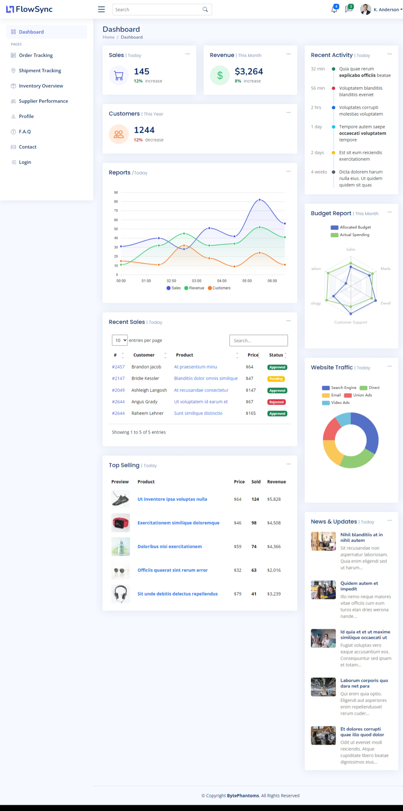

# Supply Chain Management System Dashboard

## Overview
The **Supply Chain Management System Dashboard** is a web-based application designed to streamline and optimize supply chain operations. The dashboard provides real-time insights, tools for tracking inventory, managing orders, and analyzing performance across the supply chain.

This system is built to enhance efficiency, reduce costs, and improve decision-making by centralizing critical supply chain processes in one platform.

---

## Features
- **Real-Time Dashboard**:
  - Monitor key supply chain metrics, including inventory levels, order status, and delivery timelines.
- **Inventory Management**:
  - Add, update, and track inventory across multiple locations.
- **Order Tracking**:
  - Manage customer and supplier orders with status updates.
- **Reports and Analytics**:
  - Generate reports to analyze supply chain performance and identify bottlenecks.
- **Role-Based Access**:
  - Secure access with different permissions for administrators, managers, and staff.
- **Responsive Design**:
  - Access the dashboard on desktops, tablets, and mobile devices.

---

## Technology Stack
- **Frontend**: HTML, CSS, JavaScript, Bootstrap.
- **Backend**: PHP
- **Database**: MySQL
- **Tools and Libraries**:
  - Ajax for seamless data updates.
  - Chart.js or other visualization tools for analytics.
- **Development Environment**: 
  - Visual Studio Code, WAMP Server for local testing.

---

## Installation
Follow these steps to set up the project on your local machine:

1. **Clone the Repository**:
   ```bash
   git clone https://github.com/brayanj4y/Supply-chain-dashboard-with-boostrap.git
   cd supply-chain-dashboard-with-boostrap
   
### Login:
Access the system with role-based credentials.

### Dashboard:
View real-time metrics and navigate to different sections (e.g., inventory, orders, analytics).

### Manage Data:
Add or update inventory, track orders, and generate reports.

---

## Screenshots

---

## 🤝 Contributing

Contributions are always welcome! To contribute to this project, follow these steps:

1. **Fork the Repository**  
   - Click the `Fork` button at the top right of this repository. This creates your own copy of the repository under your GitHub account.

2. **Clone Your Forked Repository**  
   - Open your terminal and run the following command:
     ```bash
     git clone https://github.com/brayanj4y/Supply-chain-management-dashboard-with-boostrap.git
     ```
   - Replace `<your-username>` with your GitHub username and `<repo-name>` with the repository name.

3. **Create a New Branch**  
   - Navigate to the project directory:
     ```bash
     cd  https://github.com/brayanj4y/Supply-chain-management-dashboard-with-boostrap.git
     ```
   - Create and switch to a new branch for your feature or fix:
     ```bash
     git checkout -b <branch-name>
     ```
   - Replace `<branch-name>` with a descriptive name, e.g., `feature/add-new-feature` or `bugfix/fix-issue`.

4. **Make Changes**  
   - Implement your changes or fix the issue.  
   - Save and test your changes locally.

5. **Stage and Commit Your Changes**  
   - Stage the files you modified:
     ```bash
     git add .
     ```
   - Commit your changes with a descriptive message:
     ```bash
     git commit -m "Add: <short description of changes>"
     ```

6. **Push Changes to Your Fork**  
   - Push your branch to your forked repository:
     ```bash
     git push origin <branch-name>
     ```

7. **Create a Pull Request (PR)**  
   - Go to the original repository on GitHub.
   - Click the **Pull Requests** tab and then **New Pull Request**.
   - Select your branch and provide a clear title and description of your changes.
   - Submit the PR for review.

   
## 📞 Contact the Developer

Have questions or suggestions? Feel free to reach out!

- **Email:** [souopsylvain@gmail.com](mailto:souopsylvain@gmail.com)
- **GitHub:** [github.com/brayanj4y](https://github.com/brayanj4y)
- **LinkedIn:** [linkedin.com/in/brayanj4y](https://linkedin.com/in/brayanj4y)

I’d love to hear your feedback and ideas. Let's build something great together!
Thank you for helping improve this project! Your contributions are appreciated. 🎉

